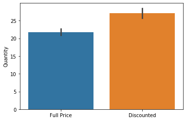
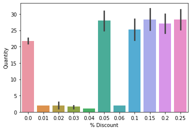
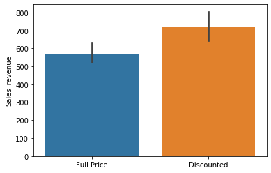
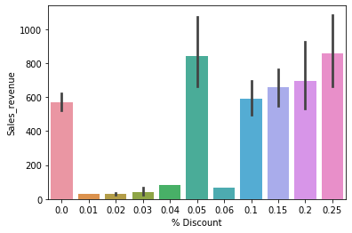
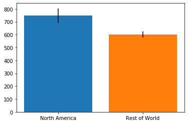
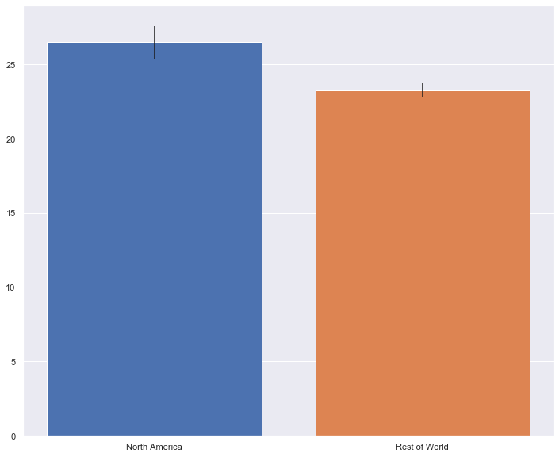

# Hypothesis Testing Project

## Getting Started

1. Clone this repo [Github Pages](https://github.com/Dantarshi/dsc-mod-3-project-online-ds-ft-100719).

2. Raw Data is being kept (raw_data_clusters.csv) within this repo.

3. main notebook link [Github Notebook](https://github.com/Dantarshi/dsc-mod-3-project-online-ds-ft-100719/blob/master/Mod%203%20project.ipynb)

## Project Intro/Objective
The purpose of this project is to carry out statistical analysis that will generate analytical insight on the company's operational businesses around the world that can be of value to the company.

## Methods Used
* Inferential Statistics
* Statistical modeling
* Data Visualization
* Database Querying
* etc.

## Technologies 
* Python
* Seaborn
* Pandas, jupyter
* Scipy
* Matplotlib
* SQLite3
* etc. 

## Project Description

This project performs statistical analysis and hypothsis testing by implementing different techniques to answer 4 key research questions. Each question has a hypothesis that is been tested to find out if we can reject that hypothesis or not.

## Research Question

* Does discount amount have a statistically significant effect on the quantity of a    product in an order? If so, at what level(s) of discount?

* Does discount have statistically significance on sales revenue? If so, at what level(s) of discount?

* Is there statistically significant difference in the mean sales revenue in North America vs the rest of the countries?

* Is there a statistical difference between the mean quantity of products ordered by customers from North America vs the rest of the world?

            
## Needs of this project

- Data exploration/descriptive statistics.
- Data Querying and processing.
- Statistical modeling.
- Visualization.
- Writeup/reporting.

## Importing and cleaning data

Data for this project is gotten from an open-source dataset created by Microsoft containing data from a fictional company called Northwind and is imported into jupyter notebook using SQLite3.

## Hypothesis 1

Does discount amount have a statistically significant effect on the quantity of a product in an order? If so, at what level(s) of discount?

$𝐻_0$: Discount has no effect on the quantity of product in an ordered when comparing discount customers and non discount customers.

$𝐻_1$: The quantity of product ordered by discount customer is greater than the quantity of product ordered by non discount customers.

## Experimental Design

I split the data into 2 groups, controled(Full Price) with respect to quantity and experimental group(Discounted) with respect to quantity and it visually look as:

The percentage discounts are shown below:

I performed Mann-Whitney U test since the groups are non parametric, 

MannwhitneyuResult(statistic=461541.0, pvalue=6.629381826999866e-11)

The p-value is less than 0.05

Cohen's D = 0.2862724481729282 which is has a small effective size.

I finally performed a pairwise tukey comparism. 

## Findings

The p-value is less than 0.05

Cohen's D = 0.29 (too small to be seen by naked eye)

Tukey Test shows 5%, 15%, 20%, 25% has significant effect on the quantity of product in an order.

I reject the null hypothesis

## Hypothesis 2

Does discount have statistically significance on sales revenue? If so, at what level(s) of discount?

$𝐻_0$: Discount has no effect on the sales revenue

$𝐻_1$: Discount has effect on the sales revenue

## Experimental Design

I split the data into 2 groups using SQLite3, controled(Full Price) with respect to sales revenue and experimental group(Discounted) with respect to sales revenue and it visually look as:

The percentage discounts are shown below:

I performed Mann-Whitney U test since the groups are non parametric,

MannwhitneyuResult(statistic=481980.5, pvalue=3.526900409461034e-07)

The p-value is less than 0.05

Cohen's D = 0.14550532043633307 which is has a small effective size.

I ran a pairwise tukey comparism.

## Findings

The p-value is less than 0.05

Cohen's D = 0.15 (too small to be seen by naked eye)

Tukey Test shows 5%, 25% has no significant difference on sale revenue.

I reject the null hypothesis

## Hypothesis 3

Is there statistically significant difference in the mean sales revenue in North America vs the rest of the countries?

$𝐻_o$:The mean sales for the North America is thesame as the rest of the countries combined

$𝐻_1$: The mean sales from North America is more than the mean sales for rest of the countries.

## Experimental Design

I queried data for North America and the rest of the world using SQLite3 and the mean sales for these regions looks like:

I performed a two-sample T-Test and the results shows:

T-test_indResult(statistic=-2.333670945823791, pvalue=0.019947978580506773)

The p-value is 0.02 which is less than 0.05

Cohen's D = 0.14048978188173492

## Findings

The p-value is 0.02 which is less than 0.05

Cohen's D = 0.14 (too small to be seen by naked eye)

I reject the null hypothesis

## Hypothesis 4

Is there a statistical difference between the mean quantity of products ordered by customers from North America vs the rest of the world?

$𝐻_o$: There is no difference in the mean quantity ordered by customers in North America vs the world.

$𝐻_1$: The mean quantity of product ordered by customers in North America is greater than the mean quantity ordered by the rest of the world.

## Experimental Design

I queried data for North America and the rest of the world using SQLite3 and the average quantity for these regions and it looks like:

I performed a welch's test because the group sizes are different and also did a two-sample test and the results:

Ttest_indResult(statistic=-2.7427622902755946, pvalue=0.006282273797625049)

Cohen's D = 0.16937825416696875

# Findings

The p-value is 0.006 which is less than 0.05

Cohen's D = 0.17 (too small to be seen by naked eye)

I reject the null hypothesis

## Conclusion

The statistical experinment answered all the important questions and the following hypothesis are ALL REJECTED
* Discount has no effect on the quantity of product in an ordered when comparing discount customers and non discount customers. 

However, the discount of 5%, 15%, 20%, 25% hve an effect on the quantity of product ordered.

* Discount has no effect on the sales revenue.

However, the discount of 5%, 25% has significant difference on sale revenue.

* The mean sales for the North America is thesame as the rest of the countries combined.

* There is no difference in the mean quantity ordered by customers in North America vs the world
