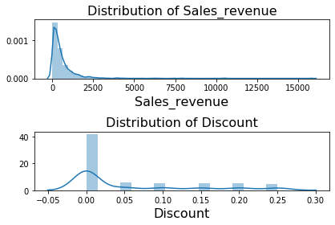

# Hypothesis Testing Project

## Introduction and Business case

In this project, we will query the neccesary data to answer some crucial questions using hypothesis testing.

## Importing Libraries, and gathering data into  Dataframe


```python
import pandas as pd
import sqlite3

#creating a connection to the database
conn = sqlite3.connect('Northwind_small.sqlite')
cur = conn.cursor()

#querying the database
cur.execute("""SELECT * 
               FROM OrderDetail """)
#Storing results in dataframe
df = pd.DataFrame(cur.fetchall())
df.columns = [x[0] for x in cur.description]
df.head()
```


<div>
<style scoped>
    .dataframe tbody tr th:only-of-type {
        vertical-align: middle;
    }

    .dataframe tbody tr th {
        vertical-align: top;
    }

    .dataframe thead th {
        text-align: right;
    }
</style>
<table border="1" class="dataframe">
  <thead>
    <tr style="text-align: right;">
      <th></th>
      <th>Id</th>
      <th>OrderId</th>
      <th>ProductId</th>
      <th>UnitPrice</th>
      <th>Quantity</th>
      <th>Discount</th>
    </tr>
  </thead>
  <tbody>
    <tr>
      <td>0</td>
      <td>10248/11</td>
      <td>10248</td>
      <td>11</td>
      <td>14.0</td>
      <td>12</td>
      <td>0.0</td>
    </tr>
    <tr>
      <td>1</td>
      <td>10248/42</td>
      <td>10248</td>
      <td>42</td>
      <td>9.8</td>
      <td>10</td>
      <td>0.0</td>
    </tr>
    <tr>
      <td>2</td>
      <td>10248/72</td>
      <td>10248</td>
      <td>72</td>
      <td>34.8</td>
      <td>5</td>
      <td>0.0</td>
    </tr>
    <tr>
      <td>3</td>
      <td>10249/14</td>
      <td>10249</td>
      <td>14</td>
      <td>18.6</td>
      <td>9</td>
      <td>0.0</td>
    </tr>
    <tr>
      <td>4</td>
      <td>10249/51</td>
      <td>10249</td>
      <td>51</td>
      <td>42.4</td>
      <td>40</td>
      <td>0.0</td>
    </tr>
  </tbody>
</table>
</div>


```python
cur.execute("""SELECT name FROM sqlite_master WHERE type='table';""")
df_tables = pd.DataFrame(cur.fetchall(), columns=['Table'])
df_tables
```


<div>
<style scoped>
    .dataframe tbody tr th:only-of-type {
        vertical-align: middle;
    }

    .dataframe tbody tr th {
        vertical-align: top;
    }

    .dataframe thead th {
        text-align: right;
    }
</style>
<table border="1" class="dataframe">
  <thead>
    <tr style="text-align: right;">
      <th></th>
      <th>Table</th>
    </tr>
  </thead>
  <tbody>
    <tr>
      <td>0</td>
      <td>Employee</td>
    </tr>
    <tr>
      <td>1</td>
      <td>Category</td>
    </tr>
    <tr>
      <td>2</td>
      <td>Customer</td>
    </tr>
    <tr>
      <td>3</td>
      <td>Shipper</td>
    </tr>
    <tr>
      <td>4</td>
      <td>Supplier</td>
    </tr>
    <tr>
      <td>5</td>
      <td>Order</td>
    </tr>
    <tr>
      <td>6</td>
      <td>Product</td>
    </tr>
    <tr>
      <td>7</td>
      <td>OrderDetail</td>
    </tr>
    <tr>
      <td>8</td>
      <td>CustomerCustomerDemo</td>
    </tr>
    <tr>
      <td>9</td>
      <td>CustomerDemographic</td>
    </tr>
    <tr>
      <td>10</td>
      <td>Region</td>
    </tr>
    <tr>
      <td>11</td>
      <td>Territory</td>
    </tr>
    <tr>
      <td>12</td>
      <td>EmployeeTerritory</td>
    </tr>
  </tbody>
</table>
</div>


```python
#effect size
#### Cohen's d
def Cohen_d(group1, group2):
    # Compute Cohen's d.
    # group1: Series or NumPy array
    # group2: Series or NumPy array
    # returns a floating point number 
    diff = group1.mean() - group2.mean()

    n1, n2 = len(group1), len(group2)
    var1 = group1.var()
    var2 = group2.var()

    # Calculate the pooled threshold as shown earlier
    pooled_var = (n1 * var1 + n2 * var2) / (n1 + n2)
    
    # Calculate Cohen's d statistic
    d = diff / np.sqrt(pooled_var)
    
    return d
```

## Hypothese 1

Does discount amount have a statistically significant effect on the quantity of a product in an order? If so, at what level(s) of discount?

$H_0$: Discount has no effect on the quantity of product in an ordered when comparing discount customers and non discount customers

$H_1$: The quantity of product ordered by discount customer is greater than the quantity of product ordered by non discount customers

### Experiment Design  

Spliting data into two groups, Control and experimental groups


```python
#Creating the groups
control = df[df['Discount'] == 0]
ctrl = control['Quantity']
#control_label = control['Discount']


experiment = df[df['Discount'] !=0]
exp = experiment['Quantity']
#exp_label = exp['Discount']
```


```python
df['discounted'] = np.where(df['Discount']==0,'Full Price', 'Discounted')
df.head()
```


<div>
<style scoped>
    .dataframe tbody tr th:only-of-type {
        vertical-align: middle;
    }

    .dataframe tbody tr th {
        vertical-align: top;
    }

    .dataframe thead th {
        text-align: right;
    }
</style>
<table border="1" class="dataframe">
  <thead>
    <tr style="text-align: right;">
      <th></th>
      <th>Id</th>
      <th>OrderId</th>
      <th>ProductId</th>
      <th>UnitPrice</th>
      <th>Quantity</th>
      <th>Discount</th>
      <th>discounted</th>
    </tr>
  </thead>
  <tbody>
    <tr>
      <td>0</td>
      <td>10248/11</td>
      <td>10248</td>
      <td>11</td>
      <td>14.0</td>
      <td>12</td>
      <td>0.0</td>
      <td>Full Price</td>
    </tr>
    <tr>
      <td>1</td>
      <td>10248/42</td>
      <td>10248</td>
      <td>42</td>
      <td>9.8</td>
      <td>10</td>
      <td>0.0</td>
      <td>Full Price</td>
    </tr>
    <tr>
      <td>2</td>
      <td>10248/72</td>
      <td>10248</td>
      <td>72</td>
      <td>34.8</td>
      <td>5</td>
      <td>0.0</td>
      <td>Full Price</td>
    </tr>
    <tr>
      <td>3</td>
      <td>10249/14</td>
      <td>10249</td>
      <td>14</td>
      <td>18.6</td>
      <td>9</td>
      <td>0.0</td>
      <td>Full Price</td>
    </tr>
    <tr>
      <td>4</td>
      <td>10249/51</td>
      <td>10249</td>
      <td>51</td>
      <td>42.4</td>
      <td>40</td>
      <td>0.0</td>
      <td>Full Price</td>
    </tr>
  </tbody>
</table>
</div>


```python
ax = sns.barplot(x='discounted', y='Quantity', data= df)
ax.set_xlabel('')
```


    Text(0.5, 0, '')


```python
ax = sns.barplot(x='Discount', y='Quantity', data= df)
ax.set_xlabel('% Discount')
```


    Text(0.5, 0, '% Discount')


```python
import matplotlib.pyplot as plt
import seaborn as sns
#dist plot of Quantity values
plt.subplot(211)
sns.distplot(df['Quantity'], hist='density')
plt.title('Distribution of Quantity', fontsize=16)
plt.xlabel('Quantity', fontsize=16)
#dist plot of discount values
plt.subplot(212)
sns.distplot(df['Discount'], hist='density')
plt.title('Distribution of Discount', fontsize=16)
plt.xlabel('Discount', fontsize=16)
plt.tight_layout()
plt.show()

```


### Assumptions

1. Normalitity --
The population data should be normal.


```python
import scipy.stats as stat

# visual check for normality
plt.figure(figsize=(20, 10))
sns.distplot(ctrl, label='Control')
sns.distplot(exp, label='Experiment',kde=True, hist=True )
plt.title('Visual Check for Normality', fontsize=25)
plt.xlabel('Quantity/Order', fontsize=20)
plt.legend(fontsize=55);

```


```python
print(stat.normaltest(ctrl))
print(stat.normaltest(exp))
```

    NormaltestResult(statistic=544.5770045551502, pvalue=5.579637380545965e-119)
    NormaltestResult(statistic=261.528012299789, pvalue=1.6214878452829618e-57)
    

2. Independence -- The quantity of product ordered by a customer is independent of the next customer

3. Random -- Samples must be randomly selected so that every observation has equal chance of selection

### Mann-Whitney U test

Since the groups non parametric we will use Mann-Whhitney U test


```python
stat.mannwhitneyu(ctrl, exp)
```


    MannwhitneyuResult(statistic=461541.0, pvalue=6.629381826999866e-11)


The Pvalue is less that 0.05 so we reject the null hypothesis that Discount has no effect on the quantity of product in an ordered when comparing discount customers and non discount customers

### Effect Size
Cohen's D


```python
abs(Cohen_d(ctrl, exp))
```


    0.2862724481729282


Cohen's D is 0.29 which has a small effect size

Now we know that discount amount has a statistically significant effect on quantity of product ordered


```python

```


```python
#checking the length of the 2 groups
len_control_data = len(ctrl)
len_exp_data = len(exp)
len_control_data, len_exp_data
```


    (1317, 838)


### Tukey test


```python
data = df['Quantity'].values
labels = df['Discount'].values

#Run Tukey test
import statsmodels.api as sms
model = sms.stats.multicomp.pairwise_tukeyhsd(data,labels)
#model.summary()

```


```python
tukey_OQD = pd.DataFrame(data=model._results_table[1:], columns=model._results_table[0])
# tukey_OQD.loc[tukey_OQD['reject'] == True]
tukey_OQD
```


<div>
<style scoped>
    .dataframe tbody tr th:only-of-type {
        vertical-align: middle;
    }

    .dataframe tbody tr th {
        vertical-align: top;
    }

    .dataframe thead th {
        text-align: right;
    }
</style>
<table border="1" class="dataframe">
  <thead>
    <tr style="text-align: right;">
      <th></th>
      <th>group1</th>
      <th>group2</th>
      <th>meandiff</th>
      <th>p-adj</th>
      <th>lower</th>
      <th>upper</th>
      <th>reject</th>
    </tr>
  </thead>
  <tbody>
    <tr>
      <td>0</td>
      <td>0.0</td>
      <td>0.01</td>
      <td>-19.7153</td>
      <td>0.9</td>
      <td>-80.3306</td>
      <td>40.9001</td>
      <td>False</td>
    </tr>
    <tr>
      <td>1</td>
      <td>0.0</td>
      <td>0.02</td>
      <td>-19.7153</td>
      <td>0.9</td>
      <td>-62.593</td>
      <td>23.1625</td>
      <td>False</td>
    </tr>
    <tr>
      <td>2</td>
      <td>0.0</td>
      <td>0.03</td>
      <td>-20.0486</td>
      <td>0.725</td>
      <td>-55.0714</td>
      <td>14.9742</td>
      <td>False</td>
    </tr>
    <tr>
      <td>3</td>
      <td>0.0</td>
      <td>0.04</td>
      <td>-20.7153</td>
      <td>0.9</td>
      <td>-81.3306</td>
      <td>39.9001</td>
      <td>False</td>
    </tr>
    <tr>
      <td>4</td>
      <td>0.0</td>
      <td>0.05</td>
      <td>6.2955</td>
      <td>0.0011</td>
      <td>1.5381</td>
      <td>11.053</td>
      <td>True</td>
    </tr>
    <tr>
      <td>5</td>
      <td>0.0</td>
      <td>0.06</td>
      <td>-19.7153</td>
      <td>0.9</td>
      <td>-80.3306</td>
      <td>40.9001</td>
      <td>False</td>
    </tr>
    <tr>
      <td>6</td>
      <td>0.0</td>
      <td>0.1</td>
      <td>3.5217</td>
      <td>0.4269</td>
      <td>-1.3783</td>
      <td>8.4217</td>
      <td>False</td>
    </tr>
    <tr>
      <td>7</td>
      <td>0.0</td>
      <td>0.15</td>
      <td>6.6669</td>
      <td>0.0014</td>
      <td>1.551</td>
      <td>11.7828</td>
      <td>True</td>
    </tr>
    <tr>
      <td>8</td>
      <td>0.0</td>
      <td>0.2</td>
      <td>5.3096</td>
      <td>0.0303</td>
      <td>0.2508</td>
      <td>10.3684</td>
      <td>True</td>
    </tr>
    <tr>
      <td>9</td>
      <td>0.0</td>
      <td>0.25</td>
      <td>6.525</td>
      <td>0.0023</td>
      <td>1.3647</td>
      <td>11.6852</td>
      <td>True</td>
    </tr>
    <tr>
      <td>10</td>
      <td>0.01</td>
      <td>0.02</td>
      <td>0.0</td>
      <td>0.9</td>
      <td>-74.2101</td>
      <td>74.2101</td>
      <td>False</td>
    </tr>
    <tr>
      <td>11</td>
      <td>0.01</td>
      <td>0.03</td>
      <td>-0.3333</td>
      <td>0.9</td>
      <td>-70.2993</td>
      <td>69.6326</td>
      <td>False</td>
    </tr>
    <tr>
      <td>12</td>
      <td>0.01</td>
      <td>0.04</td>
      <td>-1.0</td>
      <td>0.9</td>
      <td>-86.6905</td>
      <td>84.6905</td>
      <td>False</td>
    </tr>
    <tr>
      <td>13</td>
      <td>0.01</td>
      <td>0.05</td>
      <td>26.0108</td>
      <td>0.9</td>
      <td>-34.745</td>
      <td>86.7667</td>
      <td>False</td>
    </tr>
    <tr>
      <td>14</td>
      <td>0.01</td>
      <td>0.06</td>
      <td>0.0</td>
      <td>0.9</td>
      <td>-85.6905</td>
      <td>85.6905</td>
      <td>False</td>
    </tr>
    <tr>
      <td>15</td>
      <td>0.01</td>
      <td>0.1</td>
      <td>23.237</td>
      <td>0.9</td>
      <td>-37.5302</td>
      <td>84.0042</td>
      <td>False</td>
    </tr>
    <tr>
      <td>16</td>
      <td>0.01</td>
      <td>0.15</td>
      <td>26.3822</td>
      <td>0.9</td>
      <td>-34.4028</td>
      <td>87.1671</td>
      <td>False</td>
    </tr>
    <tr>
      <td>17</td>
      <td>0.01</td>
      <td>0.2</td>
      <td>25.0248</td>
      <td>0.9</td>
      <td>-35.7554</td>
      <td>85.805</td>
      <td>False</td>
    </tr>
    <tr>
      <td>18</td>
      <td>0.01</td>
      <td>0.25</td>
      <td>26.2403</td>
      <td>0.9</td>
      <td>-34.5485</td>
      <td>87.029</td>
      <td>False</td>
    </tr>
    <tr>
      <td>19</td>
      <td>0.02</td>
      <td>0.03</td>
      <td>-0.3333</td>
      <td>0.9</td>
      <td>-55.6463</td>
      <td>54.9796</td>
      <td>False</td>
    </tr>
    <tr>
      <td>20</td>
      <td>0.02</td>
      <td>0.04</td>
      <td>-1.0</td>
      <td>0.9</td>
      <td>-75.2101</td>
      <td>73.2101</td>
      <td>False</td>
    </tr>
    <tr>
      <td>21</td>
      <td>0.02</td>
      <td>0.05</td>
      <td>26.0108</td>
      <td>0.6622</td>
      <td>-17.0654</td>
      <td>69.087</td>
      <td>False</td>
    </tr>
    <tr>
      <td>22</td>
      <td>0.02</td>
      <td>0.06</td>
      <td>0.0</td>
      <td>0.9</td>
      <td>-74.2101</td>
      <td>74.2101</td>
      <td>False</td>
    </tr>
    <tr>
      <td>23</td>
      <td>0.02</td>
      <td>0.1</td>
      <td>23.237</td>
      <td>0.7914</td>
      <td>-19.8552</td>
      <td>66.3292</td>
      <td>False</td>
    </tr>
    <tr>
      <td>24</td>
      <td>0.02</td>
      <td>0.15</td>
      <td>26.3822</td>
      <td>0.6461</td>
      <td>-16.7351</td>
      <td>69.4994</td>
      <td>False</td>
    </tr>
    <tr>
      <td>25</td>
      <td>0.02</td>
      <td>0.2</td>
      <td>25.0248</td>
      <td>0.7089</td>
      <td>-18.0857</td>
      <td>68.1354</td>
      <td>False</td>
    </tr>
    <tr>
      <td>26</td>
      <td>0.02</td>
      <td>0.25</td>
      <td>26.2403</td>
      <td>0.6528</td>
      <td>-16.8823</td>
      <td>69.3628</td>
      <td>False</td>
    </tr>
    <tr>
      <td>27</td>
      <td>0.03</td>
      <td>0.04</td>
      <td>-0.6667</td>
      <td>0.9</td>
      <td>-70.6326</td>
      <td>69.2993</td>
      <td>False</td>
    </tr>
    <tr>
      <td>28</td>
      <td>0.03</td>
      <td>0.05</td>
      <td>26.3441</td>
      <td>0.3639</td>
      <td>-8.9214</td>
      <td>61.6096</td>
      <td>False</td>
    </tr>
    <tr>
      <td>29</td>
      <td>0.03</td>
      <td>0.06</td>
      <td>0.3333</td>
      <td>0.9</td>
      <td>-69.6326</td>
      <td>70.2993</td>
      <td>False</td>
    </tr>
    <tr>
      <td>30</td>
      <td>0.03</td>
      <td>0.1</td>
      <td>23.5703</td>
      <td>0.5338</td>
      <td>-11.7147</td>
      <td>58.8553</td>
      <td>False</td>
    </tr>
    <tr>
      <td>31</td>
      <td>0.03</td>
      <td>0.15</td>
      <td>26.7155</td>
      <td>0.3436</td>
      <td>-8.6001</td>
      <td>62.0311</td>
      <td>False</td>
    </tr>
    <tr>
      <td>32</td>
      <td>0.03</td>
      <td>0.2</td>
      <td>25.3582</td>
      <td>0.428</td>
      <td>-9.9492</td>
      <td>60.6656</td>
      <td>False</td>
    </tr>
    <tr>
      <td>33</td>
      <td>0.03</td>
      <td>0.25</td>
      <td>26.5736</td>
      <td>0.3525</td>
      <td>-8.7485</td>
      <td>61.8957</td>
      <td>False</td>
    </tr>
    <tr>
      <td>34</td>
      <td>0.04</td>
      <td>0.05</td>
      <td>27.0108</td>
      <td>0.9</td>
      <td>-33.745</td>
      <td>87.7667</td>
      <td>False</td>
    </tr>
    <tr>
      <td>35</td>
      <td>0.04</td>
      <td>0.06</td>
      <td>1.0</td>
      <td>0.9</td>
      <td>-84.6905</td>
      <td>86.6905</td>
      <td>False</td>
    </tr>
    <tr>
      <td>36</td>
      <td>0.04</td>
      <td>0.1</td>
      <td>24.237</td>
      <td>0.9</td>
      <td>-36.5302</td>
      <td>85.0042</td>
      <td>False</td>
    </tr>
    <tr>
      <td>37</td>
      <td>0.04</td>
      <td>0.15</td>
      <td>27.3822</td>
      <td>0.9</td>
      <td>-33.4028</td>
      <td>88.1671</td>
      <td>False</td>
    </tr>
    <tr>
      <td>38</td>
      <td>0.04</td>
      <td>0.2</td>
      <td>26.0248</td>
      <td>0.9</td>
      <td>-34.7554</td>
      <td>86.805</td>
      <td>False</td>
    </tr>
    <tr>
      <td>39</td>
      <td>0.04</td>
      <td>0.25</td>
      <td>27.2403</td>
      <td>0.9</td>
      <td>-33.5485</td>
      <td>88.029</td>
      <td>False</td>
    </tr>
    <tr>
      <td>40</td>
      <td>0.05</td>
      <td>0.06</td>
      <td>-26.0108</td>
      <td>0.9</td>
      <td>-86.7667</td>
      <td>34.745</td>
      <td>False</td>
    </tr>
    <tr>
      <td>41</td>
      <td>0.05</td>
      <td>0.1</td>
      <td>-2.7738</td>
      <td>0.9</td>
      <td>-9.1822</td>
      <td>3.6346</td>
      <td>False</td>
    </tr>
    <tr>
      <td>42</td>
      <td>0.05</td>
      <td>0.15</td>
      <td>0.3714</td>
      <td>0.9</td>
      <td>-6.2036</td>
      <td>6.9463</td>
      <td>False</td>
    </tr>
    <tr>
      <td>43</td>
      <td>0.05</td>
      <td>0.2</td>
      <td>-0.986</td>
      <td>0.9</td>
      <td>-7.5166</td>
      <td>5.5447</td>
      <td>False</td>
    </tr>
    <tr>
      <td>44</td>
      <td>0.05</td>
      <td>0.25</td>
      <td>0.2294</td>
      <td>0.9</td>
      <td>-6.3801</td>
      <td>6.839</td>
      <td>False</td>
    </tr>
    <tr>
      <td>45</td>
      <td>0.06</td>
      <td>0.1</td>
      <td>23.237</td>
      <td>0.9</td>
      <td>-37.5302</td>
      <td>84.0042</td>
      <td>False</td>
    </tr>
    <tr>
      <td>46</td>
      <td>0.06</td>
      <td>0.15</td>
      <td>26.3822</td>
      <td>0.9</td>
      <td>-34.4028</td>
      <td>87.1671</td>
      <td>False</td>
    </tr>
    <tr>
      <td>47</td>
      <td>0.06</td>
      <td>0.2</td>
      <td>25.0248</td>
      <td>0.9</td>
      <td>-35.7554</td>
      <td>85.805</td>
      <td>False</td>
    </tr>
    <tr>
      <td>48</td>
      <td>0.06</td>
      <td>0.25</td>
      <td>26.2403</td>
      <td>0.9</td>
      <td>-34.5485</td>
      <td>87.029</td>
      <td>False</td>
    </tr>
    <tr>
      <td>49</td>
      <td>0.1</td>
      <td>0.15</td>
      <td>3.1452</td>
      <td>0.9</td>
      <td>-3.5337</td>
      <td>9.824</td>
      <td>False</td>
    </tr>
    <tr>
      <td>50</td>
      <td>0.1</td>
      <td>0.2</td>
      <td>1.7879</td>
      <td>0.9</td>
      <td>-4.8474</td>
      <td>8.4231</td>
      <td>False</td>
    </tr>
    <tr>
      <td>51</td>
      <td>0.1</td>
      <td>0.25</td>
      <td>3.0033</td>
      <td>0.9</td>
      <td>-3.7096</td>
      <td>9.7161</td>
      <td>False</td>
    </tr>
    <tr>
      <td>52</td>
      <td>0.15</td>
      <td>0.2</td>
      <td>-1.3573</td>
      <td>0.9</td>
      <td>-8.1536</td>
      <td>5.4389</td>
      <td>False</td>
    </tr>
    <tr>
      <td>53</td>
      <td>0.15</td>
      <td>0.25</td>
      <td>-0.1419</td>
      <td>0.9</td>
      <td>-7.014</td>
      <td>6.7302</td>
      <td>False</td>
    </tr>
    <tr>
      <td>54</td>
      <td>0.2</td>
      <td>0.25</td>
      <td>1.2154</td>
      <td>0.9</td>
      <td>-5.6143</td>
      <td>8.0451</td>
      <td>False</td>
    </tr>
  </tbody>
</table>
</div>


### Conclusion 1

The model produces pvalue(6.629e-11) < alpha, so we reject the null hypothesis. The cohen's D is 0.28 which shows a small effect that can not be seen by the naked eye. In a pairwise tukey comparism we found statistically significant comparism between 0 and each of 5, 15, 20 and 25% discount yield effect on quantity of products ordered.

## Hypothesis 2

Does discount have statistically significance on sales revenue? If so, at what level(s) of discount?

$H_0$: Discount has no effect on the sales revenue

$H_0$: Discount has effect on the sales revenue

### Experiment Design 2


```python
#querying the database
cur.execute("""SELECT Unitprice, Quantity, Discount, Unitprice * Quantity as Sales_revenue
FROM OrderDetail """)
#Storing results in dataframe
df = pd.DataFrame(cur.fetchall())
df.columns = [x[0] for x in cur.description]
df.head()
```


<div>
<style scoped>
    .dataframe tbody tr th:only-of-type {
        vertical-align: middle;
    }

    .dataframe tbody tr th {
        vertical-align: top;
    }

    .dataframe thead th {
        text-align: right;
    }
</style>
<table border="1" class="dataframe">
  <thead>
    <tr style="text-align: right;">
      <th></th>
      <th>UnitPrice</th>
      <th>Quantity</th>
      <th>Discount</th>
      <th>Sales_revenue</th>
    </tr>
  </thead>
  <tbody>
    <tr>
      <td>0</td>
      <td>14.0</td>
      <td>12</td>
      <td>0.0</td>
      <td>168.0</td>
    </tr>
    <tr>
      <td>1</td>
      <td>9.8</td>
      <td>10</td>
      <td>0.0</td>
      <td>98.0</td>
    </tr>
    <tr>
      <td>2</td>
      <td>34.8</td>
      <td>5</td>
      <td>0.0</td>
      <td>174.0</td>
    </tr>
    <tr>
      <td>3</td>
      <td>18.6</td>
      <td>9</td>
      <td>0.0</td>
      <td>167.4</td>
    </tr>
    <tr>
      <td>4</td>
      <td>42.4</td>
      <td>40</td>
      <td>0.0</td>
      <td>1696.0</td>
    </tr>
  </tbody>
</table>
</div>


```python
import matplotlib.pyplot as plt
import seaborn as sns
#dist plot of Sales Revenue values
plt.subplot(211)
sns.distplot(df['Sales_revenue'], hist='density')
plt.title('Distribution of Sales_revenue', fontsize=16)
plt.xlabel('Sales_revenue', fontsize=16)
#dist plot of discount values
plt.subplot(212)
sns.distplot(df['Discount'], hist='density')
plt.title('Distribution of Discount', fontsize=16)
plt.xlabel('Discount', fontsize=16)
plt.tight_layout()
plt.show()
```





Creating groups


```python
#Creating the groups
control1 = df[df['Discount'] == 0]
ctrl1 = control1['Sales_revenue']

experiment1 = df[df['Discount'] !=0]
exp1 = experiment1['Sales_revenue']

```


```python
df['discounted'] = np.where(df['Discount']==0,'Full Price', 'Discounted')
df.head()
```


<div>
<style scoped>
    .dataframe tbody tr th:only-of-type {
        vertical-align: middle;
    }

    .dataframe tbody tr th {
        vertical-align: top;
    }

    .dataframe thead th {
        text-align: right;
    }
</style>
<table border="1" class="dataframe">
  <thead>
    <tr style="text-align: right;">
      <th></th>
      <th>UnitPrice</th>
      <th>Quantity</th>
      <th>Discount</th>
      <th>Sales_revenue</th>
      <th>discounted</th>
    </tr>
  </thead>
  <tbody>
    <tr>
      <td>0</td>
      <td>14.0</td>
      <td>12</td>
      <td>0.0</td>
      <td>168.0</td>
      <td>Full Price</td>
    </tr>
    <tr>
      <td>1</td>
      <td>9.8</td>
      <td>10</td>
      <td>0.0</td>
      <td>98.0</td>
      <td>Full Price</td>
    </tr>
    <tr>
      <td>2</td>
      <td>34.8</td>
      <td>5</td>
      <td>0.0</td>
      <td>174.0</td>
      <td>Full Price</td>
    </tr>
    <tr>
      <td>3</td>
      <td>18.6</td>
      <td>9</td>
      <td>0.0</td>
      <td>167.4</td>
      <td>Full Price</td>
    </tr>
    <tr>
      <td>4</td>
      <td>42.4</td>
      <td>40</td>
      <td>0.0</td>
      <td>1696.0</td>
      <td>Full Price</td>
    </tr>
  </tbody>
</table>
</div>


```python
ax = sns.barplot(x='discounted', y='Sales_revenue', data= df)
ax.set_xlabel('')
```


    Text(0.5, 0, '')


```python
ax = sns.barplot(x='Discount', y='Sales_revenue', data= df)
ax.set_xlabel('% Discount')
```


    Text(0.5, 0, '% Discount')


### Assumptions


```python
import scipy.stats as stat

# visual check for normality
plt.figure(figsize=(20, 10))
sns.distplot(ctrl1, label='Control1')
sns.distplot(exp1, label='Experiment1',kde=True, hist=True )
plt.title('Visual Check for Normality', fontsize=25)
plt.xlabel('Sales_revenue', fontsize=20)
plt.legend(fontsize=55);
```


```python
print(stat.normaltest(ctrl1))
print(stat.normaltest(exp1))
```

    NormaltestResult(statistic=1762.622893841281, pvalue=0.0)
    NormaltestResult(statistic=1026.5610842353467, pvalue=1.216446154957058e-223)
    


```python

```

### Mann-Whitney U-test


```python
stat.mannwhitneyu(ctrl1, exp1)
```


    MannwhitneyuResult(statistic=481980.5, pvalue=3.526900409461034e-07)


The model produces pvalue(3.527e-07) < alpha, so we reject the null hypothesis.

### Effective size


```python
abs(Cohen_d(ctrl1, exp1))
```


    0.14550532043633307


Cohen's D was is found to be 0.145 which has a very small statistically significant effect on sales revenue

### Tukey test


```python
data = df['Sales_revenue'].values
labels = df['Discount'].values

#Run Tukey test
import statsmodels.api as sms
model = sms.stats.multicomp.pairwise_tukeyhsd(data,labels)
model.summary()

```


<table class="simpletable">
<caption>Multiple Comparison of Means - Tukey HSD, FWER=0.05</caption>
<tr>
  <th>group1</th> <th>group2</th> <th>meandiff</th>   <th>p-adj</th>    <th>lower</th>     <th>upper</th>   <th>reject</th>
</tr>
<tr>
    <td>0.0</td>   <td>0.01</td>  <td>-540.0065</td>   <td>0.9</td>   <td>-3870.951</td> <td>2790.9379</td>  <td>False</td>
</tr>
<tr>
    <td>0.0</td>   <td>0.02</td>  <td>-539.5065</td>   <td>0.9</td>  <td>-2895.7333</td> <td>1816.7202</td>  <td>False</td>
</tr>
<tr>
    <td>0.0</td>   <td>0.03</td>  <td>-528.4565</td>   <td>0.9</td>  <td>-2453.0368</td> <td>1396.1237</td>  <td>False</td>
</tr>
<tr>
    <td>0.0</td>   <td>0.04</td>  <td>-489.0065</td>   <td>0.9</td>   <td>-3819.951</td> <td>2841.9379</td>  <td>False</td>
</tr>
<tr>
    <td>0.0</td>   <td>0.05</td>  <td>269.9216</td>  <td>0.0362</td>   <td>8.4896</td>   <td>531.3536</td>   <td>True</td> 
</tr>
<tr>
    <td>0.0</td>   <td>0.06</td>  <td>-502.0065</td>   <td>0.9</td>   <td>-3832.951</td> <td>2828.9379</td>  <td>False</td>
</tr>
<tr>
    <td>0.0</td>    <td>0.1</td>   <td>17.6565</td>    <td>0.9</td>   <td>-251.6084</td> <td>286.9214</td>   <td>False</td>
</tr>
<tr>
    <td>0.0</td>   <td>0.15</td>   <td>85.716</td>     <td>0.9</td>   <td>-195.4149</td> <td>366.8469</td>   <td>False</td>
</tr>
<tr>
    <td>0.0</td>    <td>0.2</td>  <td>122.3933</td>    <td>0.9</td>   <td>-155.5997</td> <td>400.3864</td>   <td>False</td>
</tr>
<tr>
    <td>0.0</td>   <td>0.25</td>  <td>286.6044</td>   <td>0.045</td>   <td>3.0375</td>   <td>570.1714</td>   <td>True</td> 
</tr>
<tr>
   <td>0.01</td>   <td>0.02</td>     <td>0.5</td>      <td>0.9</td>  <td>-4077.5092</td> <td>4078.5092</td>  <td>False</td>
</tr>
<tr>
   <td>0.01</td>   <td>0.03</td>    <td>11.55</td>     <td>0.9</td>  <td>-3833.2339</td> <td>3856.3339</td>  <td>False</td>
</tr>
<tr>
   <td>0.01</td>   <td>0.04</td>    <td>51.0</td>      <td>0.9</td>  <td>-4657.8794</td> <td>4759.8794</td>  <td>False</td>
</tr>
<tr>
   <td>0.01</td>   <td>0.05</td>  <td>809.9282</td>    <td>0.9</td>  <td>-2528.7394</td> <td>4148.5957</td>  <td>False</td>
</tr>
<tr>
   <td>0.01</td>   <td>0.06</td>    <td>38.0</td>      <td>0.9</td>  <td>-4670.8794</td> <td>4746.8794</td>  <td>False</td>
</tr>
<tr>
   <td>0.01</td>    <td>0.1</td>  <td>557.6631</td>    <td>0.9</td>   <td>-2781.627</td> <td>3896.9531</td>  <td>False</td>
</tr>
<tr>
   <td>0.01</td>   <td>0.15</td>  <td>625.7225</td>    <td>0.9</td>  <td>-2714.5453</td> <td>3965.9904</td>  <td>False</td>
</tr>
<tr>
   <td>0.01</td>    <td>0.2</td>  <td>662.3999</td>    <td>0.9</td>  <td>-2677.6053</td> <td>4002.4051</td>  <td>False</td>
</tr>
<tr>
   <td>0.01</td>   <td>0.25</td>   <td>826.611</td>    <td>0.9</td>  <td>-2513.8627</td> <td>4167.0847</td>  <td>False</td>
</tr>
<tr>
   <td>0.02</td>   <td>0.03</td>    <td>11.05</td>     <td>0.9</td>  <td>-3028.5186</td> <td>3050.6186</td>  <td>False</td>
</tr>
<tr>
   <td>0.02</td>   <td>0.04</td>    <td>50.5</td>      <td>0.9</td>  <td>-4027.5092</td> <td>4128.5092</td>  <td>False</td>
</tr>
<tr>
   <td>0.02</td>   <td>0.05</td>  <td>809.4282</td>    <td>0.9</td>   <td>-1557.704</td> <td>3176.5604</td>  <td>False</td>
</tr>
<tr>
   <td>0.02</td>   <td>0.06</td>    <td>37.5</td>      <td>0.9</td>  <td>-4040.5092</td> <td>4115.5092</td>  <td>False</td>
</tr>
<tr>
   <td>0.02</td>    <td>0.1</td>  <td>557.1631</td>    <td>0.9</td>   <td>-1810.847</td> <td>2925.1731</td>  <td>False</td>
</tr>
<tr>
   <td>0.02</td>   <td>0.15</td>  <td>625.2225</td>    <td>0.9</td>  <td>-1744.1661</td> <td>2994.6112</td>  <td>False</td>
</tr>
<tr>
   <td>0.02</td>    <td>0.2</td>  <td>661.8999</td>    <td>0.9</td>  <td>-1707.1185</td> <td>3030.9183</td>  <td>False</td>
</tr>
<tr>
   <td>0.02</td>   <td>0.25</td>   <td>826.111</td>    <td>0.9</td>   <td>-1543.568</td> <td>3195.7899</td>  <td>False</td>
</tr>
<tr>
   <td>0.03</td>   <td>0.04</td>    <td>39.45</td>     <td>0.9</td>  <td>-3805.3339</td> <td>3884.2339</td>  <td>False</td>
</tr>
<tr>
   <td>0.03</td>   <td>0.05</td>  <td>798.3782</td>    <td>0.9</td>  <td>-1139.5381</td> <td>2736.2944</td>  <td>False</td>
</tr>
<tr>
   <td>0.03</td>   <td>0.06</td>    <td>26.45</td>     <td>0.9</td>  <td>-3818.3339</td> <td>3871.2339</td>  <td>False</td>
</tr>
<tr>
   <td>0.03</td>    <td>0.1</td>  <td>546.1131</td>    <td>0.9</td>  <td>-1392.8754</td> <td>2485.1015</td>  <td>False</td>
</tr>
<tr>
   <td>0.03</td>   <td>0.15</td>  <td>614.1725</td>    <td>0.9</td>  <td>-1326.4993</td> <td>2554.8444</td>  <td>False</td>
</tr>
<tr>
   <td>0.03</td>    <td>0.2</td>  <td>650.8499</td>    <td>0.9</td>  <td>-1289.3699</td> <td>2591.0697</td>  <td>False</td>
</tr>
<tr>
   <td>0.03</td>   <td>0.25</td>   <td>815.061</td>    <td>0.9</td>  <td>-1125.9653</td> <td>2756.0872</td>  <td>False</td>
</tr>
<tr>
   <td>0.04</td>   <td>0.05</td>  <td>758.9282</td>    <td>0.9</td>  <td>-2579.7394</td> <td>4097.5957</td>  <td>False</td>
</tr>
<tr>
   <td>0.04</td>   <td>0.06</td>    <td>-13.0</td>     <td>0.9</td>  <td>-4721.8794</td> <td>4695.8794</td>  <td>False</td>
</tr>
<tr>
   <td>0.04</td>    <td>0.1</td>  <td>506.6631</td>    <td>0.9</td>   <td>-2832.627</td> <td>3845.9531</td>  <td>False</td>
</tr>
<tr>
   <td>0.04</td>   <td>0.15</td>  <td>574.7225</td>    <td>0.9</td>  <td>-2765.5453</td> <td>3914.9904</td>  <td>False</td>
</tr>
<tr>
   <td>0.04</td>    <td>0.2</td>  <td>611.3999</td>    <td>0.9</td>  <td>-2728.6053</td> <td>3951.4051</td>  <td>False</td>
</tr>
<tr>
   <td>0.04</td>   <td>0.25</td>   <td>775.611</td>    <td>0.9</td>  <td>-2564.8627</td> <td>4116.0847</td>  <td>False</td>
</tr>
<tr>
   <td>0.05</td>   <td>0.06</td>  <td>-771.9282</td>   <td>0.9</td>  <td>-4110.5957</td> <td>2566.7394</td>  <td>False</td>
</tr>
<tr>
   <td>0.05</td>    <td>0.1</td>  <td>-252.2651</td> <td>0.4322</td>  <td>-604.4212</td>  <td>99.891</td>    <td>False</td>
</tr>
<tr>
   <td>0.05</td>   <td>0.15</td>  <td>-184.2056</td> <td>0.8503</td>  <td>-545.5156</td> <td>177.1043</td>   <td>False</td>
</tr>
<tr>
   <td>0.05</td>    <td>0.2</td>  <td>-147.5283</td>   <td>0.9</td>   <td>-506.4021</td> <td>211.3456</td>   <td>False</td>
</tr>
<tr>
   <td>0.05</td>   <td>0.25</td>   <td>16.6828</td>    <td>0.9</td>   <td>-346.5258</td> <td>379.8915</td>   <td>False</td>
</tr>
<tr>
   <td>0.06</td>    <td>0.1</td>  <td>519.6631</td>    <td>0.9</td>   <td>-2819.627</td> <td>3858.9531</td>  <td>False</td>
</tr>
<tr>
   <td>0.06</td>   <td>0.15</td>  <td>587.7225</td>    <td>0.9</td>  <td>-2752.5453</td> <td>3927.9904</td>  <td>False</td>
</tr>
<tr>
   <td>0.06</td>    <td>0.2</td>  <td>624.3999</td>    <td>0.9</td>  <td>-2715.6053</td> <td>3964.4051</td>  <td>False</td>
</tr>
<tr>
   <td>0.06</td>   <td>0.25</td>   <td>788.611</td>    <td>0.9</td>  <td>-2551.8627</td> <td>4129.0847</td>  <td>False</td>
</tr>
<tr>
    <td>0.1</td>   <td>0.15</td>   <td>68.0595</td>    <td>0.9</td>   <td>-298.9579</td> <td>435.0769</td>   <td>False</td>
</tr>
<tr>
    <td>0.1</td>    <td>0.2</td>  <td>104.7368</td>    <td>0.9</td>   <td>-259.8826</td> <td>469.3562</td>   <td>False</td>
</tr>
<tr>
    <td>0.1</td>   <td>0.25</td>  <td>268.9479</td>  <td>0.4037</td>  <td>-99.9388</td>  <td>637.8346</td>   <td>False</td>
</tr>
<tr>
   <td>0.15</td>    <td>0.2</td>   <td>36.6773</td>    <td>0.9</td>   <td>-336.7906</td> <td>410.1453</td>   <td>False</td>
</tr>
<tr>
   <td>0.15</td>   <td>0.25</td>  <td>200.8884</td>   <td>0.806</td>  <td>-176.7469</td> <td>578.5237</td>   <td>False</td>
</tr>
<tr>
    <td>0.2</td>   <td>0.25</td>  <td>164.2111</td>    <td>0.9</td>   <td>-211.0941</td> <td>539.5163</td>   <td>False</td>
</tr>
</table>


```python
tukey_OQD = pd.DataFrame(data=model._results_table[1:], columns=model._results_table[0])
tukey_OQD.head(10)

```


<div>
<style scoped>
    .dataframe tbody tr th:only-of-type {
        vertical-align: middle;
    }

    .dataframe tbody tr th {
        vertical-align: top;
    }

    .dataframe thead th {
        text-align: right;
    }
</style>
<table border="1" class="dataframe">
  <thead>
    <tr style="text-align: right;">
      <th></th>
      <th>group1</th>
      <th>group2</th>
      <th>meandiff</th>
      <th>p-adj</th>
      <th>lower</th>
      <th>upper</th>
      <th>reject</th>
    </tr>
  </thead>
  <tbody>
    <tr>
      <td>0</td>
      <td>0.0</td>
      <td>0.01</td>
      <td>-540.0065</td>
      <td>0.9</td>
      <td>-3870.951</td>
      <td>2790.9379</td>
      <td>False</td>
    </tr>
    <tr>
      <td>1</td>
      <td>0.0</td>
      <td>0.02</td>
      <td>-539.5065</td>
      <td>0.9</td>
      <td>-2895.7333</td>
      <td>1816.7202</td>
      <td>False</td>
    </tr>
    <tr>
      <td>2</td>
      <td>0.0</td>
      <td>0.03</td>
      <td>-528.4565</td>
      <td>0.9</td>
      <td>-2453.0368</td>
      <td>1396.1237</td>
      <td>False</td>
    </tr>
    <tr>
      <td>3</td>
      <td>0.0</td>
      <td>0.04</td>
      <td>-489.0065</td>
      <td>0.9</td>
      <td>-3819.951</td>
      <td>2841.9379</td>
      <td>False</td>
    </tr>
    <tr>
      <td>4</td>
      <td>0.0</td>
      <td>0.05</td>
      <td>269.9216</td>
      <td>0.0362</td>
      <td>8.4896</td>
      <td>531.3536</td>
      <td>True</td>
    </tr>
    <tr>
      <td>5</td>
      <td>0.0</td>
      <td>0.06</td>
      <td>-502.0065</td>
      <td>0.9</td>
      <td>-3832.951</td>
      <td>2828.9379</td>
      <td>False</td>
    </tr>
    <tr>
      <td>6</td>
      <td>0.0</td>
      <td>0.1</td>
      <td>17.6565</td>
      <td>0.9</td>
      <td>-251.6084</td>
      <td>286.9214</td>
      <td>False</td>
    </tr>
    <tr>
      <td>7</td>
      <td>0.0</td>
      <td>0.15</td>
      <td>85.716</td>
      <td>0.9</td>
      <td>-195.4149</td>
      <td>366.8469</td>
      <td>False</td>
    </tr>
    <tr>
      <td>8</td>
      <td>0.0</td>
      <td>0.2</td>
      <td>122.3933</td>
      <td>0.9</td>
      <td>-155.5997</td>
      <td>400.3864</td>
      <td>False</td>
    </tr>
    <tr>
      <td>9</td>
      <td>0.0</td>
      <td>0.25</td>
      <td>286.6044</td>
      <td>0.045</td>
      <td>3.0375</td>
      <td>570.1714</td>
      <td>True</td>
    </tr>
  </tbody>
</table>
</div>


### Conclusion

We reject the null hypothesis since pvalue=3.526900409461034e-07). Cohen's D was is found to be 0.145 which has a very small statistically significant effect on sales revenue. statistical significance of 5 and 25% discount produce a very small effect on sales revenue. however there is no difference between 5% and 25% so only 5% discount will save the company money compared to 25%.

## Hypothesis 3

Is there statistically significant difference in the mean sales revenue in North America vs the rest of the countries?

$H_o$: The mean sales for the North America is thesame as the rest of the countries combined

$H_1$: The mean sales from North America is more than the mean sales for rest of the countries.

### Experimental Design 3

Quering data for the rest of the world

#querying the database
cur.execute("""SELECT OrderId, Quantity, UnitPrice, AVG(UnitPrice * Quantity) as Sales
               FROM Customer c LEFT JOIN 'Order' o
               ON o.CustomerId = c.Id
               LEFT JOIN OrderDetail od
               ON od.OrderId = o.Id
               WHERE Region != 'North America' """)
#Storing results in dataframe
df = pd.DataFrame(cur.fetchall())
df.columns = [x[0] for x in cur.description]
df.head()


```python
#querying the database
cur.execute("""SELECT OrderId, Region, Quantity, UnitPrice, (UnitPrice * Quantity) as Sales
               FROM Customer c LEFT JOIN 'Order' o
               ON o.CustomerId = c.Id
               LEFT JOIN OrderDetail od
               ON od.OrderId = o.Id
               WHERE Region != 'North America' """)
#Storing results in dataframe
df = pd.DataFrame(cur.fetchall())
df.columns = [x[0] for x in cur.description]
df.head()
```


<div>
<style scoped>
    .dataframe tbody tr th:only-of-type {
        vertical-align: middle;
    }

    .dataframe tbody tr th {
        vertical-align: top;
    }

    .dataframe thead th {
        text-align: right;
    }
</style>
<table border="1" class="dataframe">
  <thead>
    <tr style="text-align: right;">
      <th></th>
      <th>OrderId</th>
      <th>Region</th>
      <th>Quantity</th>
      <th>UnitPrice</th>
      <th>Sales</th>
    </tr>
  </thead>
  <tbody>
    <tr>
      <td>0</td>
      <td>10643.0</td>
      <td>Western Europe</td>
      <td>2.0</td>
      <td>12.0</td>
      <td>24.0</td>
    </tr>
    <tr>
      <td>1</td>
      <td>10643.0</td>
      <td>Western Europe</td>
      <td>21.0</td>
      <td>18.0</td>
      <td>378.0</td>
    </tr>
    <tr>
      <td>2</td>
      <td>10643.0</td>
      <td>Western Europe</td>
      <td>15.0</td>
      <td>45.6</td>
      <td>684.0</td>
    </tr>
    <tr>
      <td>3</td>
      <td>10692.0</td>
      <td>Western Europe</td>
      <td>20.0</td>
      <td>43.9</td>
      <td>878.0</td>
    </tr>
    <tr>
      <td>4</td>
      <td>10702.0</td>
      <td>Western Europe</td>
      <td>6.0</td>
      <td>10.0</td>
      <td>60.0</td>
    </tr>
  </tbody>
</table>
</div>


Quering data for North America


```python
#querying the database
cur.execute("""SELECT OrderId, Region, Quantity, UnitPrice, AVG(UnitPrice * Quantity) as Sales
               FROM Customer c LEFT JOIN 'Order' o
               ON o.CustomerId = c.Id
               LEFT JOIN OrderDetail od
               ON od.OrderId = o.Id
               WHERE Region = 'North America'""")
#Storing results in dataframe
df1 = pd.DataFrame(cur.fetchall())
df1.columns = [x[0] for x in cur.description]
df1.head(10)
```


<div>
<style scoped>
    .dataframe tbody tr th:only-of-type {
        vertical-align: middle;
    }

    .dataframe tbody tr th {
        vertical-align: top;
    }

    .dataframe thead th {
        text-align: right;
    }
</style>
<table border="1" class="dataframe">
  <thead>
    <tr style="text-align: right;">
      <th></th>
      <th>OrderId</th>
      <th>Region</th>
      <th>Quantity</th>
      <th>UnitPrice</th>
      <th>Sales</th>
    </tr>
  </thead>
  <tbody>
    <tr>
      <td>0</td>
      <td>10389</td>
      <td>North America</td>
      <td>30</td>
      <td>12</td>
      <td>746.840937</td>
    </tr>
  </tbody>
</table>
</div>


```python
#querying the database
cur.execute("""SELECT OrderId, Region, Quantity, UnitPrice, (UnitPrice * Quantity) as Sales
               FROM Customer c LEFT JOIN 'Order' o
               ON o.CustomerId = c.Id
               LEFT JOIN OrderDetail od
               ON od.OrderId = o.Id
               WHERE Region = 'North America'""")
#Storing results in dataframe
df1 = pd.DataFrame(cur.fetchall())
df1.columns = [x[0] for x in cur.description]
df1.head(10)
```


<div>
<style scoped>
    .dataframe tbody tr th:only-of-type {
        vertical-align: middle;
    }

    .dataframe tbody tr th {
        vertical-align: top;
    }

    .dataframe thead th {
        text-align: right;
    }
</style>
<table border="1" class="dataframe">
  <thead>
    <tr style="text-align: right;">
      <th></th>
      <th>OrderId</th>
      <th>Region</th>
      <th>Quantity</th>
      <th>UnitPrice</th>
      <th>Sales</th>
    </tr>
  </thead>
  <tbody>
    <tr>
      <td>0</td>
      <td>10389</td>
      <td>North America</td>
      <td>30</td>
      <td>12.0</td>
      <td>360.0</td>
    </tr>
    <tr>
      <td>1</td>
      <td>10389</td>
      <td>North America</td>
      <td>15</td>
      <td>19.2</td>
      <td>288.0</td>
    </tr>
    <tr>
      <td>2</td>
      <td>10389</td>
      <td>North America</td>
      <td>16</td>
      <td>24.8</td>
      <td>396.8</td>
    </tr>
    <tr>
      <td>3</td>
      <td>10389</td>
      <td>North America</td>
      <td>20</td>
      <td>39.4</td>
      <td>788.0</td>
    </tr>
    <tr>
      <td>4</td>
      <td>10410</td>
      <td>North America</td>
      <td>49</td>
      <td>2.0</td>
      <td>98.0</td>
    </tr>
    <tr>
      <td>5</td>
      <td>10410</td>
      <td>North America</td>
      <td>16</td>
      <td>44.0</td>
      <td>704.0</td>
    </tr>
    <tr>
      <td>6</td>
      <td>10411</td>
      <td>North America</td>
      <td>25</td>
      <td>7.7</td>
      <td>192.5</td>
    </tr>
    <tr>
      <td>7</td>
      <td>10411</td>
      <td>North America</td>
      <td>40</td>
      <td>15.5</td>
      <td>620.0</td>
    </tr>
    <tr>
      <td>8</td>
      <td>10411</td>
      <td>North America</td>
      <td>9</td>
      <td>44.0</td>
      <td>396.0</td>
    </tr>
    <tr>
      <td>9</td>
      <td>10431</td>
      <td>North America</td>
      <td>30</td>
      <td>7.6</td>
      <td>228.0</td>
    </tr>
  </tbody>
</table>
</div>


```python
df.isnull().sum()
```


    OrderId      6
    Region       0
    Quantity     6
    UnitPrice    6
    Sales        6
    dtype: int64


```python
df = df.dropna()
```


```python
df.Sales.isnull().sum()
```


    0


### Two-Sample T-Test

Since we are using the means of the sales, we will use two-sample test


```python
stat.ttest_ind(df.Sales, df1.Sales, equal_var = False)
```


    Ttest_indResult(statistic=-2.333670945823791, pvalue=0.019947978580506773)


The model produces pvalue(0.02) < alpha, so we reject the null hypothesis.

### Effective size


```python
abs(Cohen_d(df.Sales, df1.Sales))
```


    0.14048978188173492


```python
plt.bar(x = 'North America', height = df1.Sales.mean(),
        yerr = stat.sem(df1.Sales))
plt.bar(x = 'Rest of World', height = df.Sales.mean(), yerr = stat.sem(df.Sales))
plt.show();
```


### Conclusion

The model produces pvalue(0.02) < alpha, so we reject the null hypothesis that states "The mean sales for the North America is thesame as the rest of the countries combined". The cohen's D is 0.14 which shows a very small effect that can not be seen by the naked eye.


## Hypothesis 4

Is there a statistical difference between the mean quantity of products ordered by customers from North America vs the rest of the world?

$H_o$: There is no difference in the mean quantity ordered by customers in North America vs the world.

$H_1$: The mean quantity of product ordered by customers in North America is greater than the mean quantity ordered by the rest of the world.


```python
#querying the database
cur.execute("""SELECT OrderId, Region, AVG(Quantity)
               FROM Customer c LEFT JOIN 'Order' o
               ON o.CustomerId = c.Id
               LEFT JOIN OrderDetail od
               ON od.OrderId = o.Id
               WHERE Region != 'North America'
                """)
#Storing results in dataframe
df1 = pd.DataFrame(cur.fetchall())
df1.columns = [x[0] for x in cur.description]
df1.head(10)
```


<div>
<style scoped>
    .dataframe tbody tr th:only-of-type {
        vertical-align: middle;
    }

    .dataframe tbody tr th {
        vertical-align: top;
    }

    .dataframe thead th {
        text-align: right;
    }
</style>
<table border="1" class="dataframe">
  <thead>
    <tr style="text-align: right;">
      <th></th>
      <th>OrderId</th>
      <th>Region</th>
      <th>AVG(Quantity)</th>
    </tr>
  </thead>
  <tbody>
    <tr>
      <td>0</td>
      <td>10643</td>
      <td>Western Europe</td>
      <td>23.259237</td>
    </tr>
  </tbody>
</table>
</div>


```python
#querying the database
cur.execute("""SELECT OrderId, Region, Quantity
               FROM Customer c LEFT JOIN 'Order' o
               ON o.CustomerId = c.Id
               LEFT JOIN OrderDetail od
               ON od.OrderId = o.Id
               WHERE Region != 'North America'""")
#Storing results in dataframe
df2 = pd.DataFrame(cur.fetchall())
df2.columns = [x[0] for x in cur.description]
df2.head(10)
```


<div>
<style scoped>
    .dataframe tbody tr th:only-of-type {
        vertical-align: middle;
    }

    .dataframe tbody tr th {
        vertical-align: top;
    }

    .dataframe thead th {
        text-align: right;
    }
</style>
<table border="1" class="dataframe">
  <thead>
    <tr style="text-align: right;">
      <th></th>
      <th>OrderId</th>
      <th>Region</th>
      <th>Quantity</th>
    </tr>
  </thead>
  <tbody>
    <tr>
      <td>0</td>
      <td>10643.0</td>
      <td>Western Europe</td>
      <td>2.0</td>
    </tr>
    <tr>
      <td>1</td>
      <td>10643.0</td>
      <td>Western Europe</td>
      <td>15.0</td>
    </tr>
    <tr>
      <td>2</td>
      <td>10643.0</td>
      <td>Western Europe</td>
      <td>21.0</td>
    </tr>
    <tr>
      <td>3</td>
      <td>10692.0</td>
      <td>Western Europe</td>
      <td>20.0</td>
    </tr>
    <tr>
      <td>4</td>
      <td>10702.0</td>
      <td>Western Europe</td>
      <td>6.0</td>
    </tr>
    <tr>
      <td>5</td>
      <td>10702.0</td>
      <td>Western Europe</td>
      <td>15.0</td>
    </tr>
    <tr>
      <td>6</td>
      <td>10835.0</td>
      <td>Western Europe</td>
      <td>2.0</td>
    </tr>
    <tr>
      <td>7</td>
      <td>10835.0</td>
      <td>Western Europe</td>
      <td>15.0</td>
    </tr>
    <tr>
      <td>8</td>
      <td>10952.0</td>
      <td>Western Europe</td>
      <td>2.0</td>
    </tr>
    <tr>
      <td>9</td>
      <td>10952.0</td>
      <td>Western Europe</td>
      <td>16.0</td>
    </tr>
  </tbody>
</table>
</div>


```python
#querying the database
cur.execute("""SELECT OrderId, Region, Quantity
               FROM Customer c LEFT JOIN 'Order' o
               ON o.CustomerId = c.Id
               LEFT JOIN OrderDetail od
               ON od.OrderId = o.Id
               WHERE Region = 'North America' """)
#Storing results in dataframe
df3 = pd.DataFrame(cur.fetchall())
df3.columns = [x[0] for x in cur.description]
df3.head()
```


<div>
<style scoped>
    .dataframe tbody tr th:only-of-type {
        vertical-align: middle;
    }

    .dataframe tbody tr th {
        vertical-align: top;
    }

    .dataframe thead th {
        text-align: right;
    }
</style>
<table border="1" class="dataframe">
  <thead>
    <tr style="text-align: right;">
      <th></th>
      <th>OrderId</th>
      <th>Region</th>
      <th>Quantity</th>
    </tr>
  </thead>
  <tbody>
    <tr>
      <td>0</td>
      <td>10389</td>
      <td>North America</td>
      <td>15</td>
    </tr>
    <tr>
      <td>1</td>
      <td>10389</td>
      <td>North America</td>
      <td>16</td>
    </tr>
    <tr>
      <td>2</td>
      <td>10389</td>
      <td>North America</td>
      <td>20</td>
    </tr>
    <tr>
      <td>3</td>
      <td>10389</td>
      <td>North America</td>
      <td>30</td>
    </tr>
    <tr>
      <td>4</td>
      <td>10410</td>
      <td>North America</td>
      <td>16</td>
    </tr>
  </tbody>
</table>
</div>


```python
#querying the database
cur.execute("""SELECT OrderId, Region, AVG(Quantity)
               FROM Customer c LEFT JOIN 'Order' o
               ON o.CustomerId = c.Id
               LEFT JOIN OrderDetail od
               ON od.OrderId = o.Id
               WHERE Region = 'North America'
                """)
#Storing results in dataframe
df1 = pd.DataFrame(cur.fetchall())
df1.columns = [x[0] for x in cur.description]
df1.head(10)
```


<div>
<style scoped>
    .dataframe tbody tr th:only-of-type {
        vertical-align: middle;
    }

    .dataframe tbody tr th {
        vertical-align: top;
    }

    .dataframe thead th {
        text-align: right;
    }
</style>
<table border="1" class="dataframe">
  <thead>
    <tr style="text-align: right;">
      <th></th>
      <th>OrderId</th>
      <th>Region</th>
      <th>AVG(Quantity)</th>
    </tr>
  </thead>
  <tbody>
    <tr>
      <td>0</td>
      <td>10389</td>
      <td>North America</td>
      <td>26.496487</td>
    </tr>
  </tbody>
</table>
</div>


```python
df2.isnull().sum()
```


    OrderId     6
    Region      0
    Quantity    6
    dtype: int64


```python
df3.isnull().sum()
```


    OrderId     0
    Region      0
    Quantity    0
    dtype: int64


```python
df2 = df2.dropna()
```


```python
df2.Quantity.isnull().sum()
```


    0


### Experiment Design 4


```python
len(df2.Quantity), len(df3.Quantity)
```


    (1651, 427)


Because the group sizes are different, we can use the welch's test without testing for equal variance

### Two-Sample Test


```python
stat.ttest_ind(df2.Quantity, df3.Quantity, equal_var = False)
```


    Ttest_indResult(statistic=-2.7427622902755946, pvalue=0.006282273797625049)


The model produces pvalue(0.0063) < alpha, so we reject the null hypothesis.

### Effective size


```python
abs(Cohen_d(df2.Quantity, df3.Quantity))
```


    0.16937825416696875


```python
plt.bar(x = 'North America', height = df3.Quantity.mean(),
        yerr = stat.sem(df3.Quantity))
plt.bar(x = 'Rest of World', height = df2.Quantity.mean(), yerr = stat.sem(df2.Quantity))
plt.show();
```


### Conclusion 

The model produces pvalue(0.0189) < alpha, so we reject the null hypothesis. The cohen's D is 0.13 which shows a very small effect that can not be seen by the naked eye.
